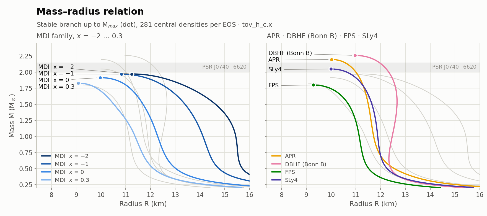
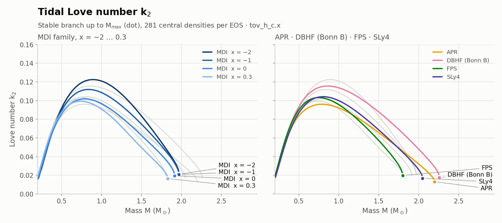
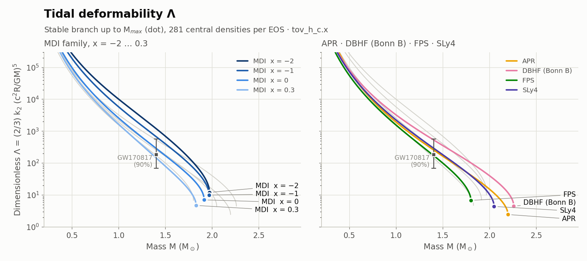
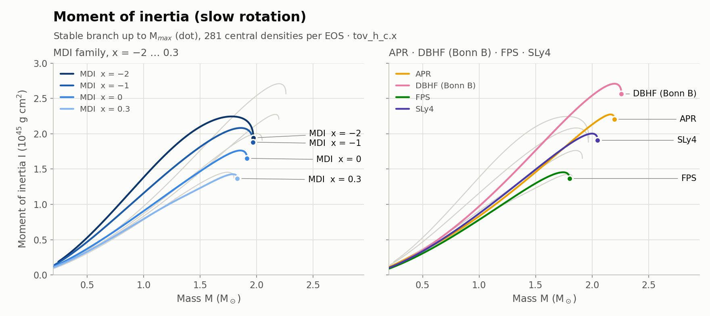
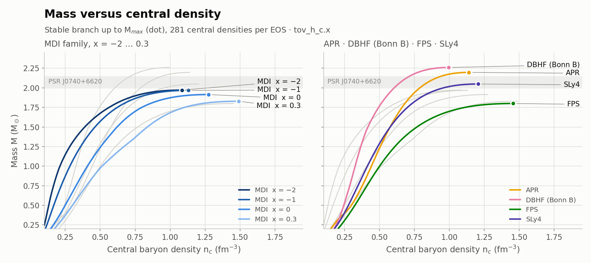

# tovSolve

**Structure of cold, spherically symmetric neutron stars from a tabulated equation of state (EOS).**
For every central density, tovSolve integrates the Tolman–Oppenheimer–Volkoff (TOV) equations together
with the equations for the tidal Love number and the moment of inertia. It returns the mass *M*, the radius *R*,
the Love number *k*<sub>2</sub>, the tidal deformability *λ*, the moment of inertia *I*, and the compactness *β*.

The code comes in **two formulations**, radius or pseudo-enthalpy as the independent variable, each in
**Fortran and C**. All four programs read EOS tables in the input format of the RNS code, and the C and
Fortran versions give bit-identical results.

<picture>
  <source media="(prefers-color-scheme: dark)" srcset="figures/mass_radius_dark.png">
  
</picture>

---

## Contents

- [Features](#features)
- [Quick start](#quick-start)
- [Programs and usage](#programs-and-usage)
- [Output](#output)
- [Results for the included EOS tables](#results-for-the-included-eos-tables)
- [Physics](#physics)
- [Numerical methods](#numerical-methods)
- [Accuracy and validation](#accuracy-and-validation)
- [Equation-of-state tables](#equation-of-state-tables)
- [Using the solvers from your own code](#using-the-solvers-from-your-own-code)
- [Repository layout](#repository-layout)
- [References](#references)
- [License](#license)

---

## Features

- **Everything in one integration.** *M*, *P*, the tidal function *y* and the frame-dragging function *f* are
  integrated together from the centre to the surface, with no stored profile and no second pass.
- **Two formalisms.**
  - **Radius:** *r* is the independent variable, and the integration stops at the surface pressure.
  - **Pseudo-enthalpy** (Lindblom 1992): *h* runs from *h*<sub>c</sub> at the centre to exactly 0 at the
    surface, so the surface is hit exactly and never has to be searched for.

  The two agree to about 10<sup>−6</sup>.
- **Adaptive Dormand–Prince 5(4) integrator.** An embedded Runge–Kutta pair whose last stage is reused as
  the first stage of the next step (FSAL), with step-size control.
- **Fortran and C, bit-identical.** The C code reproduces the Fortran floating-point evaluation order
  exactly, so both languages return the same numbers down to the last bit.
- **RNS-compatible input.** The EOS format is the one used by the RNS rotating-star code, so the same
  tables can be used for later rotating-star calculations.
- **Fast.** A sequence of 100 stars takes about 0.13 s on a single core.

## Quick start

```bash
make            # Fortran: tov.x (radius) and tov_h.x (enthalpy)
make -C c       # C:       c/tov_c.x (radius) and c/tov_h_c.x (enthalpy)

./tov_h.x                                   # MDI x = 0, n_c = 0.09 ... 1.5 fm^-3, 100 stars
c/tov_h_c.x eos_SLY4.in 0.3 1.2 4           # any EOS, density range and number of stars
```

Requirements: `gfortran` and `gcc`, or any Fortran 2008 and C99 compilers. Python and matplotlib are
needed only to regenerate the figures.

## Programs and usage

| Program | Language | Independent variable | Build | Source |
|---|---|---|---|---|
| `tov.x` | Fortran | radius *r* | `make` | `libtov.f90`, `tov_main.f90` |
| `tov_h.x` | Fortran | pseudo-enthalpy *h* | `make` | `libtov.f90`, `libtov_h.f90`, `tov_main_h.f90` |
| `c/tov_c.x` | C | radius *r* | `make -C c` | `c/tov.c`, `c/tov_main.c` |
| `c/tov_h_c.x` | C | pseudo-enthalpy *h* | `make -C c` | `c/tov.c`, `c/tov_h.c`, `c/tov_main_h.c` |

Each language has its own Makefile, and `make tov.x`-style targets build a single program. The compilers
and flags can be changed on the command line, e.g. `make FC=ifx FFLAGS=-O3` or `make -C c CC=clang`.

**Fortran programs.** Edit the parameter block at the top of `tov_main.f90` or `tov_main_h.f90`:

```fortran
  eos_file  = 'eos_MDI_x0.0.in' ! EOS
  rho_start = 0.09d0            ! Starting central baryon density (fm^-3)
  rho_end   = 1.5d0             ! Ending central baryon density (fm^-3)
  nsteps    = 100               ! Number of stars
```

**C programs.** The same defaults, overridable from the command line. Like the Fortran programs, they
read the EOS file relative to the current directory, so run them from the repository root:

```text
c/tov_c.x   [eos_file] [rho_start] [rho_end] [nsteps]
c/tov_h_c.x [eos_file] [rho_start] [rho_end] [nsteps]
```

`make clean` and `make -C c clean` remove the objects and executables.

## Output

Every program prints one row per star:

```text
         M           R            k2         lambda          I          beta         rhoc
     1.026746    12.268091     0.095501     2.651588     0.935566     0.123600     0.417576
     1.637334    11.450580     0.051595     1.014753     1.610242     0.211174     0.702424
     1.868535    10.666096     0.029642     0.408834     1.761470     0.258718     0.987273
     1.914541     9.971888     0.019672     0.193801     1.653310     0.283543     1.272121
     1.898433     9.496184     0.015299     0.118041     1.515644     0.295242     1.500000
```

| Column | Quantity | Units |
|---|---|---|
| `M` | gravitational mass | M<sub>☉</sub> |
| `R` | circumferential radius | km |
| `k2` | tidal Love number (*l* = 2) | — |
| `lambda` | tidal deformability *λ* = (2/3) *k*<sub>2</sub> *R*<sup>5</sup>/*G* | 10<sup>36</sup> g cm<sup>2</sup> s<sup>2</sup> |
| `I` | moment of inertia (slow rotation) | 10<sup>45</sup> g cm<sup>2</sup> |
| `beta` | compactness *β* = *GM*/(*Rc*<sup>2</sup>) | — |
| `rhoc` | central baryon number density *n*<sub>c</sub> | fm<sup>−3</sup> |

The dimensionless tidal deformability used in gravitational-wave work is
Λ = *λ G*/(*G M*/*c*<sup>2</sup>)<sup>5</sup> = (2/3) *k*<sub>2</sub> *β*<sup>−5</sup>.

> [!NOTE]
> Values that do not fit the fixed-width field are printed as `***********`, as Fortran does. This happens
> for *λ* at the very lowest central densities, where the "stars" have radii of hundreds of kilometres.
> The C programs print the same asterisks, so the outputs stay column-compatible.

## Results for the included EOS tables

The figures show the stable branch (up to the maximum mass, marked by a dot) for all eight tables in the
repository. Each figure has two panels: the **MDI family** in a blue ramp ordered by *x*, and the four
**other EOSs** in distinct colours. Each panel also shows the other group as gray context lines.
[`scripts/make_figures.py`](scripts/make_figures.py) generates them with `c/tov_h_c.x`.

<picture>
  <source media="(prefers-color-scheme: dark)" srcset="figures/love_number_dark.png">
  
</picture>

<picture>
  <source media="(prefers-color-scheme: dark)" srcset="figures/tidal_deformability_dark.png">
  
</picture>

<picture>
  <source media="(prefers-color-scheme: dark)" srcset="figures/moment_of_inertia_dark.png">
  
</picture>

<picture>
  <source media="(prefers-color-scheme: dark)" srcset="figures/mass_density_dark.png">
  
</picture>

The figures mark two observational constraints:
- **PSR J0740+6620:** the gray band, *M* = 2.08 ± 0.07 M<sub>☉</sub> [[O2]](#observations).
- **GW170817:** the error bar, Λ<sub>1.4</sub> = 190<sup>+390</sup><sub>−120</sub> at 90% credibility
  [[O1]](#observations).

**Table view.** These are the same data as the figures: values at the maximum mass and at
*M* = 1.4 M<sub>☉</sub>, interpolated on the stable branch.

| EOS | M<sub>max</sub> (M<sub>☉</sub>) | R at M<sub>max</sub> (km) | n<sub>c</sub> at M<sub>max</sub> (fm<sup>−3</sup>) | R<sub>1.4</sub> (km) | k<sub>2,1.4</sub> | Λ<sub>1.4</sub> | I<sub>1.4</sub> (10<sup>45</sup> g cm<sup>2</sup>) |
|---|---:|---:|---:|---:|---:|---:|---:|
| MDI x = −2 | 1.971 | 11.25 | 1.085 | 14.90 | 0.0938 | 1214 | 1.992 |
| MDI x = −1 | 1.968 | 10.83 | 1.130 | 13.59 | 0.0832 | 681 | 1.696 |
| MDI x = 0 | 1.915 | 9.97 | 1.275 | 11.85 | 0.0708 | 292 | 1.359 |
| MDI x = 0.3 | 1.829 | 9.09 | 1.490 | 10.73 | 0.0585 | 147 | 1.149 |
| APR | 2.197 | 10.01 | 1.140 | 11.55 | 0.0721 | 262 | 1.324 |
| DBHF (Bonn B) | 2.260 | 10.97 | 0.995 | 12.64 | 0.0946 | 540 | 1.597 |
| FPS | 1.800 | 9.28 | 1.455 | 10.84 | 0.0664 | 176 | 1.200 |
| SLy4 | 2.049 | 10.00 | 1.205 | 11.72 | 0.0762 | 298 | 1.367 |

To regenerate the figures and this table:

```bash
make -C c
module load python        # or any Python 3 with numpy and matplotlib
python scripts/make_figures.py
```

## Physics

Units are *G* = *c* = 1 in the equations below. In the code the TOV equations are solved in cgs units
and *y*, *f* in geometric units, with lengths in metres. *ε* is the total energy density, *P* the pressure,
and *c*<sub>s</sub><sup>2</sup> = d*P*/d*ε* the adiabatic sound speed squared along the EOS.

### Stellar structure (TOV)

$$
\frac{dm}{dr} = 4\pi r^2 \varepsilon, \qquad
\frac{dP}{dr} = -\frac{(\varepsilon + P)\,(m + 4\pi r^3 P)}{r\,(r - 2m)} .
$$

The surface *R* is where the pressure falls to the termination pressure *P*<sub>term</sub>, the second row
of the EOS table. The gravitational mass is *M* = *m*(*R*).

### Tidal Love number

The quadrupolar (*l* = 2) static tidal perturbation is described by *y* = *r H*′/*H* (Hinderer 2008
[[M2]](#methods)). It obeys a Riccati equation that is integrated alongside the TOV equations from
*y*(0) = 2:

$$
r\frac{dy}{dr} = -y^2 - y\,F(r) - r^2 Q(r),
$$

$$
F = \frac{1 - 4\pi r^2(\varepsilon - P)}{1 - 2m/r}, \qquad
Q = \frac{4\pi\left[5\varepsilon + 9P + (\varepsilon + P)/c_s^2\right]}{1 - 2m/r}
  - \frac{6}{r^2(1 - 2m/r)}
  - \frac{4m^2}{r^4}\,\frac{\left(1 + 4\pi r^3 P/m\right)^2}{(1 - 2m/r)^2} .
$$

With *y*<sub>R</sub> = *y*(*R*) and the compactness *β* = *M*/*R*,

$$
k_2 = \frac{8}{5}\,\beta^5 (1-2\beta)^2 \left[2 - y_R + 2\beta(y_R - 1)\right]
\Big\{ 2\beta\left[6 - 3y_R + 3\beta(5y_R - 8)\right]
+ 4\beta^3\left[13 - 11y_R + \beta(3y_R - 2) + 2\beta^2(1 + y_R)\right]
+ 3(1-2\beta)^2\left[2 - y_R + 2\beta(y_R - 1)\right]\ln(1 - 2\beta) \Big\}^{-1},
$$

and *λ* = (2/3) *k*<sub>2</sub> *R*<sup>5</sup>, Λ = (2/3) *k*<sub>2</sub> *β*<sup>−5</sup>.

### Moment of inertia

In the slow-rotation approximation (Hartle 1967 [[M3]](#methods)), the frame-dragging function
*f* = d ln *ω̄* / d ln *r* satisfies (Lim, Holt & Stahulak 2019 [[M4]](#methods))

$$
\frac{df}{dr} = -\frac{f}{r}\,(f + 3) + \frac{(4 + f)\,4\pi r^2 (\varepsilon + P)}{r - 2m},
\qquad
I = \frac{R^3 f_R}{6 + 2 f_R},
$$

with *f* ≈ (16π/5)(*ε*<sub>c</sub> + *P*<sub>c</sub>) *r*<sup>2</sup> near the centre.

### Enthalpy formalism

The pseudo-enthalpy (Lindblom 1992 [[M1]](#methods))

$$
h(P) = \int_{P_\mathrm{term}}^{P} \frac{dP'}{\varepsilon(P') + P'}
$$

is 0 at the surface and *h*<sub>c</sub> at the centre. With *h* as the independent variable the system becomes

$$
\frac{dr}{dh} = -\frac{r\,(r - 2m)}{m + 4\pi r^3 P}, \qquad
\frac{dm}{dh} = 4\pi r^2 \varepsilon\,\frac{dr}{dh}, \qquad
\frac{dP}{dh} = \varepsilon + P,
$$

and *y* and *f* follow from the chain rule, d/d*h* = (d*r*/d*h*) d/d*r*. The integration starts just off the
centre, at *h*<sub>0</sub> = *h*<sub>c</sub>(1 − 10<sup>−7</sup>), from Lindblom's series expansion:

$$
r(h) \simeq \sqrt{\frac{3(h_c - h)}{2\pi(\varepsilon_c + 3P_c)}}
\left[1 - \frac{\varepsilon_c - 3P_c - \tfrac{3}{5}\varepsilon_1}{4(\varepsilon_c + 3P_c)}\,(h_c - h)\right],
\qquad
m(h) \simeq \frac{4\pi}{3}\varepsilon_c r^3 \left[1 - \frac{3\varepsilon_1}{5\varepsilon_c}(h_c - h)\right],
$$

where *ε*<sub>1</sub> = d*ε*/d*h* = (*ε*<sub>c</sub> + *P*<sub>c</sub>)/*c*<sub>s,c</sub><sup>2</sup>.
Carrying *P* as a dependent variable means *ε*(*P*) and *c*<sub>s</sub><sup>2</sup> come from exactly the
same EOS interpolation as in the radius formalism. So the two formalisms solve the same EOS and can serve
as independent checks on each other.

## Numerical methods

| Component | Method |
|---|---|
| ODE integrator | Adaptive Dormand–Prince 5(4) embedded Runge–Kutta pair [[M5]](#methods), FSAL (6 derivative evaluations per step), relative tolerance 10<sup>−8</sup> |
| EOS interpolation | 3-point Lagrange interpolation of log *ε* versus log *P* |
| Sound speed | *c*<sub>s</sub><sup>2</sup> = (*P*/*ε*) / (d log *ε* / d log *P*), from the derivative of the same interpolant |
| Central enthalpy *h*<sub>c</sub> | 5-point Gauss–Legendre quadrature in log *P* on each table interval (the interpolant is smooth inside an interval) |
| Start (radius formalism) | *r*<sub>0</sub> = 1 m with a Taylor expansion for *m* and *P*; *y* = 2, *f* = 10<sup>−6</sup> |
| Surface | radius formalism: the step at which *P* ≤ *P*<sub>term</sub>; enthalpy formalism: *h* = 0 exactly |
| Minimum step | 10<sup>−6</sup> cm (radius) or 10<sup>−14</sup> *h*<sub>c</sub> (enthalpy); a warning is printed if the surface is not reached |

The sound speed jumps at every table point, because it is the derivative of a piecewise interpolant. The
adaptive stepper resolves each jump by briefly taking very small steps, which is why the minimum step
size is so small.

## Accuracy and validation

**Formalism cross-check.** Both formalisms were run at a relative tolerance of 10<sup>−11</sup> for all
8 EOS tables, 630 stars with *M* ≥ 1 M<sub>☉</sub>. They agree to:

| M | R | λ | I |
|---|---|---|---|
| identical at printed precision | 1.9 × 10<sup>−6</sup> | 3.6 × 10<sup>−6</sup> | 7 × 10<sup>−7</sup> |

**Production tolerance (10<sup>−8</sup>).** Largest relative error against the tight enthalpy run, over the
same 630 stars:

| Program | Time for 8 × 100 stars | R | k<sub>2</sub> | λ | I |
|---|---:|---:|---:|---:|---:|
| `tov.x` (radius) | 1.2 s | 3.4 × 10<sup>−5</sup> | 1.6 × 10<sup>−4</sup> | 1.7 × 10<sup>−5</sup> | 7.5 × 10<sup>−7</sup> |
| `tov_h.x` (enthalpy) | 1.2 s | 9 × 10<sup>−8</sup> | 1.0 × 10<sup>−4</sup> | 1.7 × 10<sup>−5</sup> | 7.1 × 10<sup>−7</sup> |

The *k*<sub>2</sub> and λ figures are limited by the 6-decimal output. The radius formalism's *R* error
comes from its last step overshooting *P*<sub>term</sub>; the enthalpy formalism ends exactly on the surface.

**Fortran vs C.** `c/tov_c.x` and `c/tov_h_c.x` reproduce `tov.x` and `tov_h.x` **bit for bit**: all 7 output
quantities for every star of every EOS agree at full double precision.

**Code checks.**
- The Fortran compiles with `-Wall -Wextra -std=f2008 -pedantic`. The only warnings are deliberate exact
  floating-point comparisons and one dummy argument that the stepper interface requires but the enthalpy
  equations don't use. It runs cleanly with `-fcheck=all -ffpe-trap=invalid,zero,overflow`.
- The C compiles cleanly with `-Wall -Wextra -std=c99` and is clean under valgrind: no memory errors and
  no leaks.

## Equation-of-state tables

The tables use the input format of the RNS code [[M6]](#methods). They can be produced from an
*ε*–*P* table with RNS's `HnG.c`:

```text
N                                   <- number of rows
e_1   P_1   H_1   n_1               <- energy density/c^2 (g cm^-3), pressure (dyn cm^-2),
e_2   P_2   H_2   n_2                  enthalpy (cm^2 s^-2), baryon number density (cm^-3)
...
```

| File | EOS | Rows | n<sub>max</sub> (fm<sup>−3</sup>) | Reference |
|---|---|---:|---:|---|
| `eos_MDI_x-2.0.in` | MDI, *x* = −2 | 100 | 1.53 | [[E1]](#equations-of-state) |
| `eos_MDI_x-1.0.in` | MDI, *x* = −1 | 100 | 1.54 | [[E1]](#equations-of-state) |
| `eos_MDI_x0.0.in` | MDI, *x* = 0 | 100 | 1.54 | [[E1]](#equations-of-state) |
| `eos_MDI_x0.3.in` | MDI, *x* = 0.3 | 90 | 1.56 | [[E1]](#equations-of-state) |
| `eos_APR.in` | Akmal–Pandharipande–Ravenhall | 100 | 1.50 | [[E2]](#equations-of-state) |
| `eos_DBHF_BonnB.in` | Dirac–Brueckner–Hartree–Fock, Bonn B | 100 | 1.55 | [[P5]](#related-publications-by-the-author) |
| `eos_FPS.in` | FPS | 100 | 9.99 | [[E3]](#equations-of-state) |
| `eos_SLY4.in` | SLy4 | 100 | 1.55 | [[E4]](#equations-of-state) |

In the MDI (momentum-dependent interaction) EOS, the parameter *x* sets the density dependence of the
nuclear symmetry energy. Lower *x* means a stiffer symmetry energy at high density, which gives larger
radii and tidal deformabilities.

> [!IMPORTANT]
> - **Central densities must stay inside the table.** Above *n*<sub>max</sub> the interpolation is clamped
>   to the last row, so choose `rho_end` ≤ *n*<sub>max</sub> for the EOS you use. APR ends at
>   1.496 fm<sup>−3</sup>, just below the default `rho_end` of 1.5 fm<sup>−3</sup>.
> - **The surface is at the second row of the table.** The FPS and SLy4 tables start at
>   2.4 × 10<sup>6</sup> and 4.7 × 10<sup>5</sup> g cm<sup>−3</sup>, so their outer crust is cut there.
> - **The H column is read but not used.** Both formalisms integrate d*h* = d*P*/(*ε* + *P*) along the same
>   interpolated *ε*(*P*). The H column written by `HnG.c` uses 4-point interpolation instead, and on these
>   coarse tables that differs from the 3-point value by up to 0.1–3% at low density and near neutron drip.
>   Computing *h* directly keeps both formalisms on exactly the same EOS.

## Using the solvers from your own code

**Fortran.** The central baryon density `rhoc` is in cm<sup>−3</sup> (fm<sup>−3</sup> × 10<sup>39</sup>).
Each call prints one output row; the EOS file is read only when its name changes.

```fortran
use constants                               ! fm3cm3 = 1.0d39
character(len=30) :: eos_file = 'eos_SLY4.in' ! the solvers expect len=30

call solve_tov  (eos_file, 0.5d0*fm3cm3)    ! radius formalism
call solve_tov_h(eos_file, 0.5d0*fm3cm3)    ! enthalpy formalism
```

**C.** See [`c/tov.h`](c/tov.h):

```c
#include <stdio.h>
#include "tov.h"

TovEos eos;
TovResult star;

if (tov_load_eos("eos_SLY4.in", &eos) == 0) {
    solve_tov_h(&eos, 0.5 * TOV_FM3CM3, &star);   /* or solve_tov() */
    printf("M = %.4f Msun, R = %.3f km, k2 = %.4f\n", star.mass, star.radius, star.k2);
    tov_free_eos(&eos);
}
```

Compile with `-Ic` and link with `c/tov.o`, plus `c/tov_h.o` for the enthalpy solver, and `-lm`.

## Repository layout

```text
tovSolve/
├── libtov.f90          Fortran: modules, EOS I/O and interpolation, Dormand–Prince stepper,
│                       radius-formalism solver (solve_tov), k2 / lambda / I output
├── libtov_h.f90        Fortran: enthalpy-formalism solver (solve_tov_h)
├── tov_main.f90        Fortran driver for tov.x
├── tov_main_h.f90      Fortran driver for tov_h.x
├── Makefile            Fortran build
├── c/                  C version (bit-identical to the Fortran)
│   ├── tov.h           public API
│   ├── tov_internal.h  internals shared by tov.c and tov_h.c
│   ├── tov.c           port of libtov.f90
│   ├── tov_h.c         port of libtov_h.f90
│   ├── tov_main.c      driver for tov_c.x (command-line arguments)
│   ├── tov_main_h.c    driver for tov_h_c.x
│   └── Makefile        C build
├── eos_*.in            EOS tables (RNS format)
├── scripts/
│   └── make_figures.py Figures and summary table for this README
├── figures/            Light and dark versions of each figure
├── ode.f90             Shampine–Gordon Adams solver (legacy, not built; LGPL, see License)
└── LICENSE
```

## References

### Methods

- **[M1]** L. Lindblom, *Determining the nuclear equation of state from neutron-star masses and radii*,
  Astrophys. J. **398**, 569 (1992). [doi:10.1086/171882](https://doi.org/10.1086/171882)
- **[M2]** T. Hinderer, *Tidal Love numbers of neutron stars*, Astrophys. J. **677**, 1216 (2008).
  [arXiv:0711.2420](https://arxiv.org/abs/0711.2420) ·
  [doi:10.1086/533487](https://doi.org/10.1086/533487)
- **[M3]** J. B. Hartle, *Slowly rotating relativistic stars. I. Equations of structure*,
  Astrophys. J. **150**, 1005 (1967). [doi:10.1086/149400](https://doi.org/10.1086/149400)
- **[M4]** Y. Lim, J. W. Holt and R. J. Stahulak, *Predicting the moment of inertia of pulsar J0737-3039A
  from Bayesian modeling of the nuclear equation of state*, Phys. Rev. C **100**, 035802 (2019).
  [arXiv:1810.10992](https://arxiv.org/abs/1810.10992) ·
  [doi:10.1103/PhysRevC.100.035802](https://doi.org/10.1103/PhysRevC.100.035802)
- **[M5]** J. R. Dormand and P. J. Prince, *A family of embedded Runge–Kutta formulae*,
  J. Comput. Appl. Math. **6**, 19 (1980).
  [doi:10.1016/0771-050X(80)90013-3](https://doi.org/10.1016/0771-050X(80)90013-3)
- **[M6]** N. Stergioulas and J. L. Friedman, *Comparing models of rapidly rotating relativistic stars
  constructed by two numerical methods*, Astrophys. J. **444**, 306 (1995).
  [arXiv:astro-ph/9411032](https://arxiv.org/abs/astro-ph/9411032) ·
  [doi:10.1086/175605](https://doi.org/10.1086/175605) · RNS code:
  [github.com/cgca/rns](https://github.com/cgca/rns)

### Equations of state

- **[E1]** C. B. Das, S. Das Gupta, C. Gale and B.-A. Li, *Momentum dependence of symmetry potential in
  asymmetric nuclear matter for transport model calculations*, Phys. Rev. C **67**, 034611 (2003).
  [arXiv:nucl-th/0212090](https://arxiv.org/abs/nucl-th/0212090) ·
  [doi:10.1103/PhysRevC.67.034611](https://doi.org/10.1103/PhysRevC.67.034611)
- **[E2]** A. Akmal, V. R. Pandharipande and D. G. Ravenhall, *The equation of state of nucleon matter and
  neutron star structure*, Phys. Rev. C **58**, 1804 (1998).
  [arXiv:nucl-th/9804027](https://arxiv.org/abs/nucl-th/9804027) ·
  [doi:10.1103/PhysRevC.58.1804](https://doi.org/10.1103/PhysRevC.58.1804)
- **[E3]** C. P. Lorenz, D. G. Ravenhall and C. J. Pethick, *Neutron star crusts*,
  Phys. Rev. Lett. **70**, 379 (1993).
  [doi:10.1103/PhysRevLett.70.379](https://doi.org/10.1103/PhysRevLett.70.379)
- **[E4]** F. Douchin and P. Haensel, *A unified equation of state of dense matter and neutron star
  structure*, Astron. Astrophys. **380**, 151 (2001).
  [arXiv:astro-ph/0111092](https://arxiv.org/abs/astro-ph/0111092) ·
  [doi:10.1051/0004-6361:20011402](https://doi.org/10.1051/0004-6361:20011402)

### Observations

- **[O1]** B. P. Abbott *et al.* (LIGO Scientific and Virgo Collaborations), *GW170817: Measurements of
  neutron star radii and equation of state*, Phys. Rev. Lett. **121**, 161101 (2018).
  [arXiv:1805.11581](https://arxiv.org/abs/1805.11581) ·
  [doi:10.1103/PhysRevLett.121.161101](https://doi.org/10.1103/PhysRevLett.121.161101)
- **[O2]** E. Fonseca *et al.*, *Refined mass and geometric measurements of the high-mass PSR J0740+6620*,
  Astrophys. J. Lett. **915**, L12 (2021). [arXiv:2104.00880](https://arxiv.org/abs/2104.00880) ·
  [doi:10.3847/2041-8213/ac03b8](https://doi.org/10.3847/2041-8213/ac03b8)

### Related publications by the author

Neutron-star structure, tidal deformability and moments of inertia:

- **[P1]** P. G. Krastev and B.-A. Li, *Imprints of the nuclear symmetry energy on the tidal deformability
  of neutron stars*, J. Phys. G **46**, 074001 (2019).
  [arXiv:1801.04620](https://arxiv.org/abs/1801.04620) ·
  [doi:10.1088/1361-6471/ab1a7a](https://doi.org/10.1088/1361-6471/ab1a7a)
- **[P2]** A. Worley, P. G. Krastev and B.-A. Li, *Nuclear constraints on the momenta of inertia of neutron
  stars*, Astrophys. J. **685**, 390 (2008). [arXiv:0801.1653](https://arxiv.org/abs/0801.1653)
- **[P3]** P. G. Krastev, B.-A. Li and A. Worley, *Constraining properties of rapidly rotating neutron stars
  using data from heavy-ion collisions*, Astrophys. J. **676**, 1170 (2008).
  [arXiv:0709.3621](https://arxiv.org/abs/0709.3621) ·
  [doi:10.1086/528736](https://doi.org/10.1086/528736)
- **[P4]** B.-A. Li, P. G. Krastev, D.-H. Wen and N.-B. Zhang, *Towards understanding astrophysical effects of
  nuclear symmetry energy*, Eur. Phys. J. A **55**, 117 (2019).
  [arXiv:1905.13175](https://arxiv.org/abs/1905.13175) ·
  [doi:10.1140/epja/i2019-12780-8](https://doi.org/10.1140/epja/i2019-12780-8)
- **[P5]** P. G. Krastev and F. Sammarruca, *Neutron star properties and the equation of state of
  neutron-rich matter*, Phys. Rev. C **74**, 025808 (2006).
  [arXiv:nucl-th/0601065](https://arxiv.org/abs/nucl-th/0601065) ·
  [doi:10.1103/PhysRevC.74.025808](https://doi.org/10.1103/PhysRevC.74.025808)

Gravitational waves and pulsars:

- **[P6]** P. G. Krastev, B.-A. Li and A. Worley, *Nuclear limits on gravitational waves from elliptically
  deformed pulsars*, Phys. Lett. B **668**, 1 (2008).
  [arXiv:0805.1973](https://arxiv.org/abs/0805.1973) ·
  [doi:10.1016/j.physletb.2008.07.105](https://doi.org/10.1016/j.physletb.2008.07.105)
- **[P7]** D.-H. Wen, B.-A. Li and P. G. Krastev, *Imprints of the nuclear symmetry energy on gravitational
  waves from the axial w-modes of neutron stars*, Phys. Rev. C **80**, 025801 (2009).
  [arXiv:0902.4702](https://arxiv.org/abs/0902.4702) ·
  [doi:10.1103/PhysRevC.80.025801](https://doi.org/10.1103/PhysRevC.80.025801)

Machine learning with neutron-star observables:

- **[P8]** P. G. Krastev, *Translating neutron star observations to nuclear symmetry energy via deep neural
  networks*, Galaxies **10**, 16 (2022). [arXiv:2112.04089](https://arxiv.org/abs/2112.04089) ·
  [doi:10.3390/galaxies10010016](https://doi.org/10.3390/galaxies10010016)
- **[P9]** P. G. Krastev, *A deep learning approach to extracting nuclear matter properties from neutron star
  observations*, Symmetry **15**, 1123 (2023). [arXiv:2303.17146](https://arxiv.org/abs/2303.17146) ·
  [doi:10.3390/sym15051123](https://doi.org/10.3390/sym15051123)

## License

tovSolve is released under the [MIT License](LICENSE).

The exception is `ode.f90`, the Shampine–Gordon ODE solver in John Burkardt's Fortran 90 version. It is
distributed under the GNU LGPL, as stated in the file. The current programs don't use or build it.

---

<sub>Author: Plamen G. Krastev. Figures: `scripts/make_figures.py`, colour palette validated for colour-vision
deficiency in light and dark mode.</sub>
